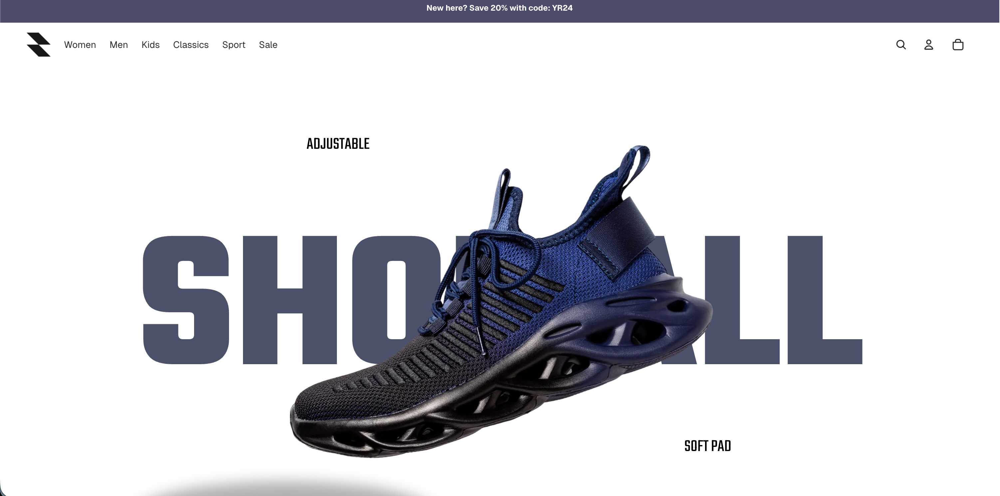

# Performance Optimization Guide

## ✅ Optimizations Applied

### 1. **Resource Hints**
- Added `preconnect` and `dns-prefetch` for Tailwind CDN
- Reduces DNS lookup time and establishes early connections

### 2. **Critical CSS Inline**
- Added critical above-the-fold styles inline
- Prevents FOUC (Flash of Unstyled Content)
- Improves First Contentful Paint (FCP)

### 3. **Async Script Loading**
- Tailwind CSS now loads asynchronously
- Prevents render-blocking (saves ~160ms)
- Config applied after Tailwind loads

### 4. **Image Optimizations**
- Added `loading="lazy"` for below-fold images
- Added `decoding="async"` for non-blocking decode
- Added explicit `width` and `height` attributes to prevent layout shift

### 5. **Animation Performance**
- Added `will-change` hints for animated elements
- Added `content-visibility: auto` for images

## 🔧 Additional Steps Required

### **CRITICAL: Image Compression** (Saves ~3,213 KiB)

Your images are too large. Compress them using:

1. **Online Tools:**
   - [TinyPNG](https://tinypng.com/) - PNG compression
   - [Squoosh](https://squoosh.app/) - Advanced compression
   - [ImageOptim](https://imageoptim.com/) - Mac app

2. **Convert to WebP:**
   ```bash
   # Using cwebp (install via: brew install webp)
   cwebp -q 80 nikee.png -o nikee.webp
   cwebp -q 80 fasco.png -o fasco.webp
   cwebp -q 80 resonance.png -o resonance.webp
   ```

3. **Target Sizes:**
   - Each image should be < 200KB
   - Use WebP format with 80% quality
   - Or PNG with aggressive compression

4. **Update HTML:**
   ```html
   <!-- Add picture element for WebP with fallback -->
   <picture>
     <source srcset="./images/nikee.webp" type="image/webp">
     
   </picture>
   ```

### **Optional: Use CDN for Images**
- Upload images to Cloudinary, Imgix, or similar
- They auto-optimize and serve WebP
- Reduces server load

### **Optional: Self-Host Tailwind**
Instead of CDN, build a minimal Tailwind CSS file:
```bash
npm install -D tailwindcss
npx tailwindcss -i ./src/input.css -o ./dist/output.css --minify
```
This reduces the CSS bundle size significantly.

## 📊 Expected Performance Improvements

After image compression:
- **Performance Score:** 56 → 85-90+
- **First Contentful Paint:** 5.7s → 1.5-2s
- **Largest Contentful Paint:** 7.2s → 2-3s
- **Speed Index:** 12.8s → 3-4s
- **Total Blocking Time:** Already 0ms ✅
- **Cumulative Layout Shift:** Already 0 ✅

## 🚀 Quick Wins

1. **Compress images** (biggest impact - 3MB savings)
2. **Test on mobile** - Mobile performance is critical
3. **Enable Gzip/Brotli** compression on your server
4. **Add caching headers** in your hosting config

## 📝 Server Configuration (if using Vercel/Netlify)

Add to `vercel.json` or `netlify.toml`:
```json
{
  "headers": [
    {
      "source": "/(.*)",
      "headers": [
        {
          "key": "Cache-Control",
          "value": "public, max-age=31536000, immutable"
        }
      ]
    }
  ]
}
```

